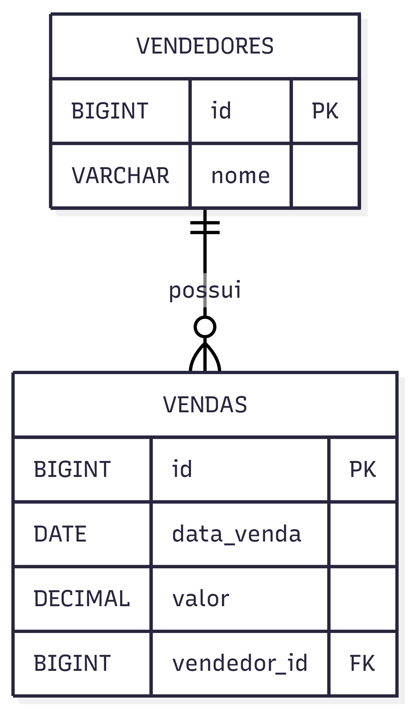
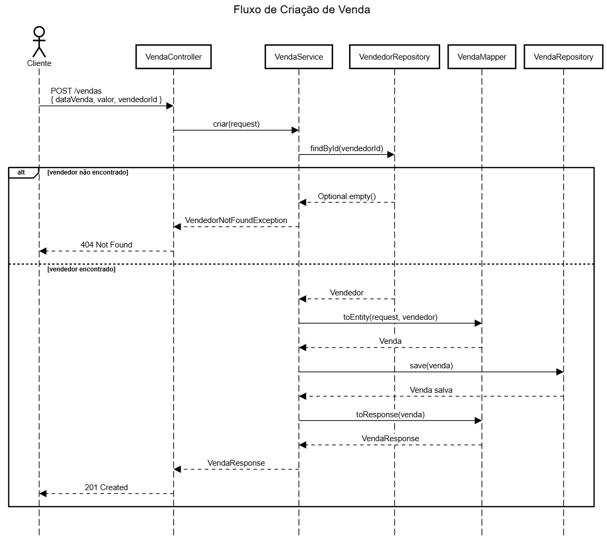
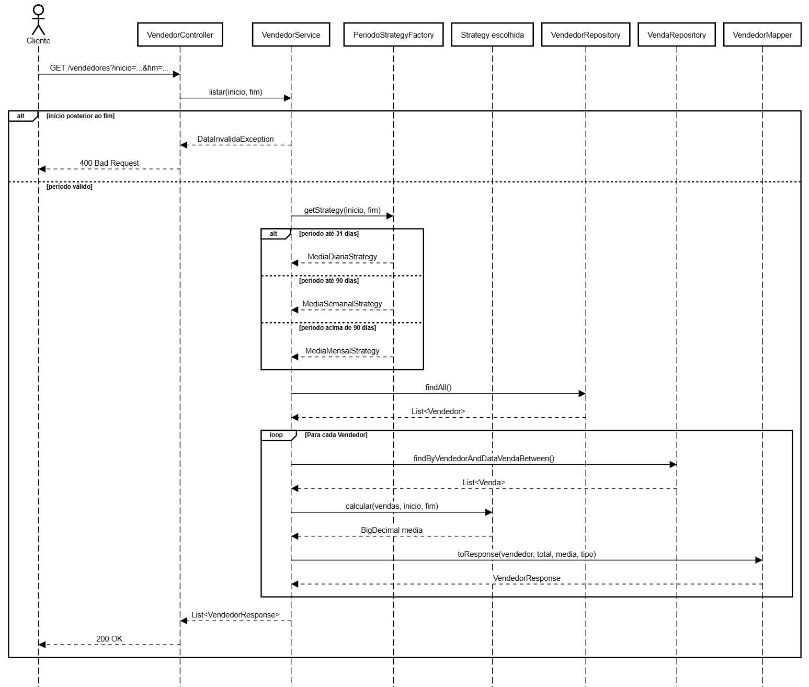

# vendas-api

API REST desenvolvida com **Spring Boot** para gerenciamento de vendas e vendedores, aplicando boas práticas de arquitetura e design patterns.

---

## Sumário

- [Sobre o projeto](#sobre-o-projeto)
- [Tecnologias utilizadas](#tecnologias-utilizadas)
- [Arquitetura e estrutura](#arquitetura-e-estrutura)
- [Diagrama de entidades](#diagrama-de-entidades)
- [Fluxo de criação de venda](#fluxo-de-criação-de-venda)
- [Fluxo de listagem de vendedores](#fluxo-de-listagem-de-vendedores)
- [Design patterns utilizados](#design-patterns-utilizados)
- [Tratamento de exceções](#tratamento-de-exceções)
- [Como rodar o projeto](#como-rodar-o-projeto)
- [Documentação interativa](#documentação-interativa)
- [Exemplos de requisições](#exemplos-de-requisições)

---

## Sobre o projeto

O projeto expõe endpoints REST para:

- Criar e listar vendas
- Criar vendedores e listá-los com o total de vendas e a média por período

A média é calculada de forma inteligente conforme o intervalo informado: diária para períodos curtos, semanal para períodos médios e mensal para períodos longos — selecionada automaticamente via **Strategy Pattern** e **Factory Pattern**.

---

## Tecnologias utilizadas
 
| Tecnologia | Descrição |
|---|---|
| Java 21 | Linguagem principal |
| Spring Boot | Framework base da aplicação |
| Spring Web | Criação dos endpoints REST |
| Spring Data JPA | Abstração da camada de persistência |
| H2 Database | Banco de dados em memória |
| Lombok | Redução de boilerplate (getters, construtores, builders) |
| Validation | Validação dos DTOs de entrada (`@NotNull`, `@NotBlank`, etc.) |
| SpringDoc OpenAPI 2.8.6 | Geração automática da especificação OpenAPI |
| Scalar | Interface interativa para explorar e testar a API |
| JUnit 5 | Framework de testes unitários |
| Mockito | Mocking de dependências nos testes |
| Maven | Gerenciamento de dependências e build |

---

## Arquitetura e estrutura

O projeto segue uma arquitetura em camadas com separação clara de responsabilidades:

```
com.gabriel.vendas/
├── controller/     → Recebe as requisições HTTP e delega ao service
├── dto/            → Objetos de entrada e saída da API + mappers
├── domain/         → Entidades de negócio (Venda, Vendedor)
├── repository/     → Interfaces Spring Data JPA
├── service/        → Regras de negócio e orquestração
├── strategy/       → Interface, implementações para cada tipo de cenário
├── factory/        → factory do cálculo de média
└── exception/      → Exceções personalizadas e handler global
└── testes/         → Testes unitários
```

---

## Diagrama de entidades


<div align="center">
  
</div>


- Um **vendedor** pode ter várias **vendas**
- Toda **venda** pertence obrigatoriamente a um **vendedor**

---

## Fluxo de criação de venda

```
POST /vendas
{ "dataVenda": "2026-05-01", "valor": 1500.00, "vendedorId": 1 }
      ↓
VendaController.criar()
      ↓
VendaService.criar()
  → busca Vendedor por id no VendedorRepository
  → lança VendedorNotFoundException (404) se não encontrado
      ↓
VendaMapper.toEntity()
  → converte CriarVendaRequest + Vendedor → Venda
      ↓
VendaRepository.save()
  → persiste no banco H2
      ↓
VendaMapper.toResponse()
  → converte Venda → VendaResponse
      ↓
201 Created
{ "id": 1, "dataVenda": "2026-05-01", "valor": 1500.00,
  "vendedorId": 1, "nomeVendedor": "Carlos Silva" }

```

<div align="center">
  
</div>
---

## Fluxo de listagem de vendedores

```
GET /vendedores?inicio=2026-01-01&fim=2026-01-31
      ↓
VendedorController.listar()
      ↓
VendedorService.listar()
  → valida se início é posterior ao fim
    → lança DataInvalidaException (400) se inválido
      ↓
PeriodoStrategyFactory.getStrategy()
  → período ≤ 31 dias  → MediaDiariaStrategy
  → período ≤ 90 dias  → MediaSemanalStrategy
  → período > 90 dias  → MediaMensalStrategy
      ↓
Para cada Vendedor:
  → busca vendas do período no VendaRepository
  → strategy.calcular(vendas, inicio, fim)
  → VendedorMapper.toResponse()
      ↓
200 OK
[{
  "id": 1,
  "nome": "Carlos Silva",
  "totalVendas": 3,
  "mediaPeriodo": 150.00,
  "tipoPeriodo": "DIARIA"
}]

```

<div align="center">
  
</div>
---

## Design patterns utilizados

### Strategy Pattern
 
A interface `MediaCalculadoraStrategy` define o contrato de cálculo de média:
 
```
MediaCalculadoraStrategy (interface)
├── calcular(vendas, inicio, fim) → BigDecimal
└── getTipo() → TipoPeriodo
 
Implementações:
├── MediaDiariaStrategy   → total / dias
├── MediaSemanalStrategy  → total / semanas
└── MediaMensalStrategy   → total / meses
```
 
**Por que usar?** Sem o Strategy, o `VendedorService` teria a lógica de cálculo embutida diretamente:
 
```java
// sem Strategy — mistura responsabilidades e viola o Open/Closed Principle
if (dias <= 31) {
    media = total.divide(BigDecimal.valueOf(dias), 2, RoundingMode.HALF_UP);
} else if (dias <= 90) {
    media = total.divide(BigDecimal.valueOf(semanas), 2, RoundingMode.HALF_UP);
} else {
    media = total.divide(BigDecimal.valueOf(meses), 2, RoundingMode.HALF_UP);
}
```
 
Isso mistura regra de negócio com lógica de cálculo no mesmo lugar. Cada vez que um novo tipo de período fosse necessário, o service precisaria ser modificado — violando o **Princípio Aberto/Fechado** do SOLID.
 
Com o Strategy, cada cálculo vive isolado na sua própria classe. O service não sabe qual strategy está usando — só chama `strategy.calcular()`. Adicionar um novo período (trimestral, por exemplo) é apenas criar uma nova classe sem tocar em nada existente.
 
### Factory Pattern
 
A `PeriodoStrategyFactory` centraliza a lógica de escolha da strategy:
 
```
PeriodoStrategyFactory.getStrategy(inicio, fim)
  → período ≤ 31 dias  → MediaDiariaStrategy
  → período ≤ 90 dias  → MediaSemanalStrategy
  → período > 90 dias  → MediaMensalStrategy
```
 
**Por que usar?** A lógica de escolha da strategy poderia estar no próprio service, mas aí o service acumularia duas responsabilidades: orquestrar o fluxo de negócio **e** decidir qual cálculo aplicar. A factory extrai essa decisão para um lugar dedicado, deixando cada classe com uma única responsabilidade — seguindo o **Single Responsibility Principle** do SOLID.

### Mapper

Cada camada tem seu próprio mapper (`VendaMapper`, `VendedorMapper`) responsável pela conversão entre entidade e DTO. O service fica limpo, focado apenas na orquestração do fluxo de negócio. Se o DTO precisar mudar, apenas o mapper é afetado.

---

## Tratamento de exceções

Todas as exceções são tratadas centralmente pelo `GlobalExceptionHandler` com respostas padronizadas:

| Situação | Exceção | HTTP |
|---|---|---|
| Vendedor não encontrado | `VendedorNotFoundException` | 404 |
| Data inválida (ex: dia 40) | `MethodArgumentTypeMismatchException` | 400 |
| Data início após fim | `DataInvalidaException` | 400 |
| Campos obrigatórios ausentes | `MethodArgumentNotValidException` | 400 |

Exemplo de response de erro:
```json
{ "erro": "Vendedor não encontrado com id: 99" }
{ "erro": "Data inválida: '2026-01-40'. Use o formato yyyy-MM-dd" }
{ "erro": "Data de início não pode ser posterior à data de fim" }
```

---

## Como rodar o projeto

**Pré-requisitos:** Java 21+ e Maven instalados.

```bash
# Clonar o repositório
git clone https://github.com/gabriel/vendas-api.git
cd vendas-api

# Rodar a aplicação
mvn spring-boot:run
```

A API estará disponível em `http://localhost:8080`.

O banco H2 é em memória e recriado a cada inicialização. Para acessar o console:

```
URL:      http://localhost:8080/h2-console
JDBC URL: jdbc:h2:mem:vendasdb
User:     vendas_admin
Password: (vazio)
```

Para rodar os testes:
```bash
mvn test
```

---

## Documentação interativa
 
A API conta com documentação interativa gerada automaticamente via **Scalar**, permitindo explorar e testar todos os endpoints diretamente pelo navegador.
 
Após rodar o projeto, acesse:
 
```
http://localhost:8080/docs
```
 
A interface permite:
- Visualizar todos os endpoints disponíveis com descrição dos campos
- Testar requisições diretamente pelo navegador sem precisar do Postman
- Ver os modelos de request e response de cada endpoint
- Baixar a especificação OpenAPI em JSON ou YAML
A especificação OpenAPI bruta também fica disponível em:
```
http://localhost:8080/v3/api-docs
```
 
---
 
## Exemplos de requisições
 
> Você pode testar todos os exemplos abaixo diretamente pelo Scalar em `http://localhost:8080/docs`.
 
### 1. Criar vendedores
 
```json
POST /vendedores
{ "nome": "Carlos Silva" }
 
POST /vendedores
{ "nome": "Ana Souza" }
```
 
---
 
### 2. Criar vendas para Carlos (id: 1)
 
```json
POST /vendas
{ "dataVenda": "2026-05-01", "valor": 1000.00, "vendedorId": 1 }
 
POST /vendas
{ "dataVenda": "2026-05-01", "valor": 500.00, "vendedorId": 1 }
 
POST /vendas
{ "dataVenda": "2026-05-03", "valor": 800.00, "vendedorId": 1 }
```
 
### 3. Criar vendas para Ana (id: 2)
 
```json
POST /vendas
{ "dataVenda": "2026-05-01", "valor": 2000.00, "vendedorId": 2 }
 
POST /vendas
{ "dataVenda": "2026-05-02", "valor": 600.00, "vendedorId": 2 }
```
 
---
 
### 4. Listar vendedores — média diária (período ≤ 31 dias)
 
```
GET /vendedores?inicio=2026-05-01&fim=2026-05-31
```
 
Cálculo esperado:
- **Carlos** — 3 vendas
  - dia 01: (1000 + 500) / 2 = **750.00**
  - dia 03: 800 / 1 = **800.00**
  - média diária = (750 + 800) / 2 = **775.00**
- **Ana** — 2 vendas
  - dia 01: 2000 / 1 = **2000.00**
  - dia 02: 600 / 1 = **600.00**
  - média diária = (2000 + 600) / 2 = **1300.00**
```json
200 OK
[
  {
    "id": 1,
    "nome": "Carlos Silva",
    "totalVendas": 3,
    "mediaPeriodo": 775.00,
    "tipoPeriodo": "DIARIA"
  },
  {
    "id": 2,
    "nome": "Ana Souza",
    "totalVendas": 2,
    "mediaPeriodo": 1300.00,
    "tipoPeriodo": "DIARIA"
  }
]
```
 
---
 
### 5. Listar vendedores — média semanal (período entre 32 e 90 dias)
 
Adiciona vendas em semanas diferentes:
```json
POST /vendas
{ "dataVenda": "2026-04-10", "valor": 3000.00, "vendedorId": 1 }
 
POST /vendas
{ "dataVenda": "2026-04-20", "valor": 1200.00, "vendedorId": 2 }
```
 
```
GET /vendedores?inicio=2026-04-01&fim=2026-05-31
```
 
Cálculo esperado:
- **Carlos** — 4 vendas
  - semana de 06/04: 3000 / 1 = **3000.00**
  - semana de 04/05: (1000 + 500 + 800) / 3 = **766.67**
  - média semanal = (3000 + 766.67) / 2 = **1883.34**
- **Ana** — 3 vendas
  - semana de 20/04: 1200 / 1 = **1200.00**
  - semana de 04/05: (2000 + 600) / 2 = **1300.00**
  - média semanal = (1200 + 1300) / 2 = **1250.00**
```json
200 OK
[
  {
    "id": 1,
    "nome": "Carlos Silva",
    "totalVendas": 4,
    "mediaPeriodo": 1883.34,
    "tipoPeriodo": "SEMANAL"
  },
  {
    "id": 2,
    "nome": "Ana Souza",
    "totalVendas": 3,
    "mediaPeriodo": 1250.00,
    "tipoPeriodo": "SEMANAL"
  }
]
```
 
---
 
### 6. Listar vendedores — média mensal (período > 90 dias)
 
Adiciona vendas em meses diferentes:
```json
POST /vendas
{ "dataVenda": "2026-02-10", "valor": 3000.00, "vendedorId": 1 }
 
POST /vendas
{ "dataVenda": "2026-03-15", "valor": 1500.00, "vendedorId": 2 }
```
 
```
GET /vendedores?inicio=2026-01-01&fim=2026-12-31
```
 
Cálculo esperado:
- **Carlos** — 5 vendas
  - fevereiro: 3000 / 1 = **3000.00**
  - abril: 3000 / 1 = **3000.00**
  - maio: (1000 + 500 + 800) / 3 = **766.67**
  - média mensal = (3000 + 3000 + 766.67) / 3 = **2255.56**
- **Ana** — 4 vendas
  - março: 1500 / 1 = **1500.00**
  - abril: 1200 / 1 = **1200.00**
  - maio: (2000 + 600) / 2 = **1300.00**
  - média mensal = (1500 + 1200 + 1300) / 3 = **1333.33**
```json
200 OK
[
  {
    "id": 1,
    "nome": "Carlos Silva",
    "totalVendas": 5,
    "mediaPeriodo": 2255.56,
    "tipoPeriodo": "MENSAL"
  },
  {
    "id": 2,
    "nome": "Ana Souza",
    "totalVendas": 4,
    "mediaPeriodo": 1333.33,
    "tipoPeriodo": "MENSAL"
  }
]
```
 
---
 
### Listar vendas
 
```
GET /vendas
```
```json
200 OK
[
  {
    "id": 1,
    "dataVenda": "2026-05-01",
    "valor": 1000.00,
    "vendedorId": 1,
    "nomeVendedor": "Carlos Silva"
  }
]
```
 
---
 
### Cenários de erro
 
**Vendedor inexistente**
```json
POST /vendas
{ "dataVenda": "2026-05-01", "valor": 1500.00, "vendedorId": 999 }
```
```json
404 Not Found
{ "erro": "Vendedor não encontrado com id: 999" }
```
 
**Data inválida**
```
GET /vendedores?inicio=2026-01-01&fim=2026-01-40
```
```json
400 Bad Request
{ "erro": "Data inválida: '2026-01-40'. Use o formato yyyy-MM-dd" }
```
 
**Período invertido**
```
GET /vendedores?inicio=2026-12-01&fim=2026-01-01
```
```json
400 Bad Request
{ "erro": "Data de início não pode ser posterior à data de fim" }
```
 
**Campos obrigatórios ausentes**
```json
POST /vendas
{ "valor": 1500.00, "vendedorId": 1 }
```
```json
400 Bad Request
{ "dataVenda": "Data da venda é obrigatória" }
```